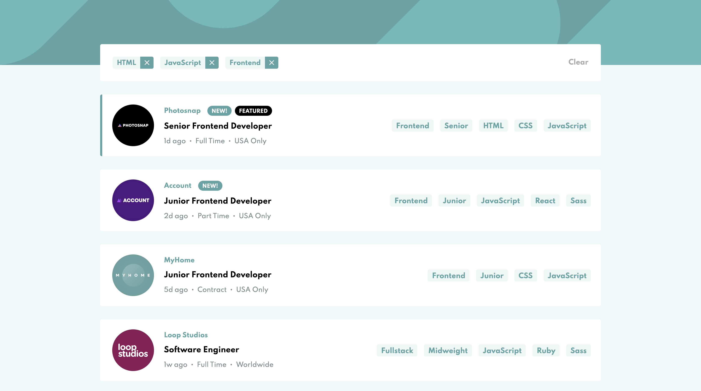

# Job listings with filtering solution in Vue3 Composition API - Frontend Mentor

This is a solution to the [Job listings with filtering challenge on Frontend Mentor](https://www.frontendmentor.io/challenges/job-listings-with-filtering-ivstIPCt). Frontend Mentor challenges help you improve your coding skills by building realistic projects. 

## Table of contents

- [Overview](#overview)
  - [The challenge](#the-challenge)
  - [Screenshot](#screenshot)
  - [Links](#links)
- [My process](#my-process)
  - [Built with](#built-with)
- [Author](#author)

## Overview

### The challenge

Users should be able to:

- View the optimal layout for the site depending on their device's screen size
- See hover states for all interactive elements on the page
- Filter job listings based on the categories

### Screenshot

### Links

- Live Site URL: [Add live site URL here](https://your-live-site-url.com)

## My process

### Built with

- Semantic HTML5 markup
- CSS variables
- Flexbox
- CSS Grid
- Mobile-first workflow
- [Vue 3](https://vuejs.org/) - JS library
- [Vuex](https://next.vuex.vuejs.org/) - Vue State Management

## Author

- Website - [John Broers](https://johnbroers.nl)
- Frontend Mentor - [@JohnBroers](https://www.frontendmentor.io/profile/JohnBroers)
- Twitter - [@johnbroerss](https://twitter.com/johnbroerss)
